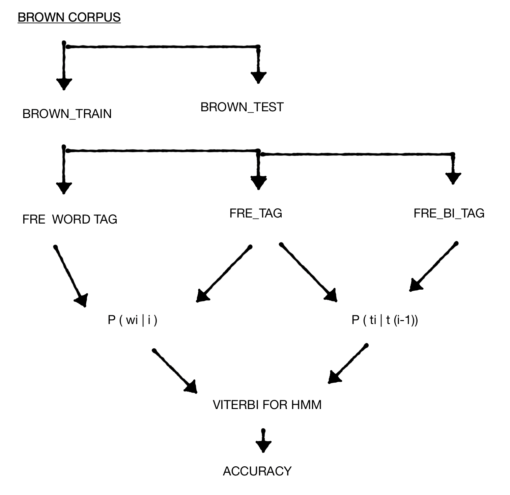

## Objective

Write a program in Python to implement an HMM-based part-of-speech (POS) tagger for English.

**Dataset**: the Brown corpus (via NLTK), which contains words paired with their POS tags.

Code: <https://github.com/pratik-ingle/HMM-tagger>

## Mathematical model

An HMM tagger is a special case of Bayesian inference. We model $P(Y \mid X)$, the probability of a tag sequence given a word sequence, using two kinds of probabilities:

- **Emission probability**: the likelihood of a word $w_i$ given a tag $t_i$, $P(w_i \mid t_i)$.
- **Transition probability**: the likelihood of a tag given the previous tags, $P(t_i \mid t_{i-1}, t_{i-2}, \dots, t_{i-k})$.

The best tag sequence is

$$
\hat{T} = \arg\max_T \prod_i P(w_i \mid t_i)\, P(t_i \mid t_{i-1}).
$$

### Training

Both probabilities are estimated from counts in the training set:

$$
P(t_i \mid t_{i-1}) = \frac{C(t_{i-1}, t_i)}{C(t_{i-1})}, \qquad
P(w_i \mid t_i) = \frac{C(t_i, w_i)}{C(t_i)}.
$$

### Viterbi algorithm

$$
V_t(j) = \max_i V_{t-1}(i)\, a_{ij}\, b_j(o_t)
$$

where $V_{t-1}(i)$ is the previous Viterbi path probability, $a_{ij}$ the transition probability, and $b_j(o_t)$ the state observation (emission) likelihood.

The total number of possible tag sequences is $T^W$ for $T$ tags and $W$ words, which is why dynamic programming is needed.

### Assumptions

1. The probability of a word depends only on its POS tag, and is independent of other words and tags.
2. The probability of a tag depends only on the previous tag (bigram assumption).

## Procedure

{fig-alt="Flow of the HMM tagger: split corpus, count frequencies, compute probabilities, run Viterbi, evaluate."}

### 1. Split the corpus

Insert start `<s>` and end `<\s>` symbols in each sentence, then hold out the first 10 sentences for testing.

```python
from nltk.corpus import brown

p = brown.tagged_sents()
brown_corpus = []
for i in p:
    i.insert(0, ('<s>', '<s>'))
    i.insert(len(i), ('<\\s>', '<\\s>'))
    brown_corpus.append(i)

brown_test = []
brown_train = []
sen = 0
for i in brown_corpus:
    sen += 1
    if sen <= 10:
        brown_test.append(i)
    else:
        brown_train.append(i)
```

### 2. Count patterns in the training set

We need three frequency tables:

- `fre_wordtag`: frequency of each (word, tag) pair
- `fre_tag`: frequency of each tag
- `fre_bi_tag`: frequency of each tag given its previous tag

```python
from collections import Counter

def fre(x):
    types = Counter(tuple(item) for item in x)
    freq = list(types.items())
    freq.sort(key=lambda f: f[1], reverse=True)
    return freq

# flatten training sentences into (word, tag) pairs
brown_words_tag = [j for i in brown_train for j in i]
fre_wordtag = fre(brown_words_tag)

# tag frequencies
brown_tag = [j[1] for i in brown_train for j in i]
fre_tag = list(Counter(brown_tag).items())
fre_tag.sort(key=lambda f: f[1], reverse=True)
```

### 3. Turn counts into probabilities

Emission probabilities $P(w_i \mid t_i) = C(t_i, w_i) / C(t_i)$:

```python
probWiti = []
for i in fre_wordtag:
    for j in fre_tag:
        if i[0][1] == j[0]:
            probWiti.append([i[0], i[1] / j[1]])
```

Transition probabilities $P(t_i \mid t_{i-1}) = C(t_{i-1}, t_i) / C(t_{i-1})$, built from tag bigrams (skipping the `<\s>` → `<s>` sentence boundary):

```python
bi_tag = []
x = len(brown_words_tag)
for j in range(x - 1):
    temp = [brown_words_tag[j][1], brown_words_tag[j + 1][1]]
    if temp != ['<\\s>', '<s>']:
        bi_tag.append(temp)

fre_bi_tag = fre(bi_tag)

probbitag = []
for i in fre_bi_tag:
    for j in fre_tag:
        if i[0][0] == j[0]:
            probbitag.append([i[0], i[1] / j[1]])
```

The set of all tags seen in training is simply:

```python
pos_tag = [i[0] for i in fre_tag]
```

Because a word's probability depends on its tag and a tag's probability depends on the previous tag, there is no `UNK` tag in the tagger itself; unknown words are handled separately below.

### 4. Viterbi decoding

With the probabilities in hand we build, for one test sentence, an emission lattice (only entries with non-zero emission probability, since a zero would zero out the whole path) and the set of transition probabilities among the tags that sentence can take.

```python
sentance = brown_test[4]   # pick any of the first 10 test sentences
l = len(sentance)

lattic_emission = [[] for _ in range(l)]
sen_tag = []
for i in range(l):
    for j in probWiti:
        if sentance[i][0] == j[0][0]:
            lattic_emission[i].append(j)
            if j[0][1] not in sen_tag:
                sen_tag.append(j[0][1])
    if len(lattic_emission[i]) == 0:
        # unknown word: treat as 'NN' with probability 0.11
        lattic_emission[i].append([(sentance[i][0], 'NN'), 0.11])

# transition probabilities restricted to tags that appear in this sentence
tran_tag = [(i, j) for i in sen_tag for j in sen_tag]
tran_pro = [j for i in tran_tag for j in probbitag if i == j[0]]

# keep the highest-emission tag for each word, then chain transitions
max_emission = []
sequence = []
for i in lattic_emission:
    i.sort(key=lambda e: e[1], reverse=True)
    max_emission.append(i)

vi = []
for i in range(len(max_emission) - 1):
    vi.append((max_emission[i][0][0][1], max_emission[i + 1][0][0][1]))
    sequence.append(max_emission[i][0][0])
sequence.append(('<\\s>', '<\\s>'))

Vj = []
for i in range(len(vi)):
    for j in tran_pro:
        if vi[i] == j[0]:
            Vj.append(max_emission[i][0][1] * j[1])

def viterbi(Vj):
    result = 1
    for x in Vj:
        result *= x
    return result

print(sequence, '\n', viterbi(Vj))
```

### 5. Accuracy

```python
count = 0
for i in range(len(sentance)):
    if sentance[i] == sequence[i]:
        count += 1
accuracy = count / len(sentance) * 100
print("accuracy of HMM tagger for given sentence is", accuracy)
```

## Results

For sentence 4 of the test set:

```text
[('<s>', '<s>'), ('The', 'AT-TL'), ('jury', 'NN-HL'), ('said', 'VBD'), ('it', 'PPS-HL'),
 ('did', 'DOD-NC'), ('find', 'VB'), ('that', 'WPS-NC'), ('many', 'AP-NC'), ('of', 'IN-TL'),
 ("Georgia's", 'NP$'), ('registration', 'NN'), ('and', 'CC-HL'), ('election', 'NN'),
 ('laws', 'NNS'), ('``', '``'), ('are', 'BER-HL'), ('outmoded', 'JJ'), ('or', 'CC-NC'),
 ('inadequate', 'JJ'), ('and', 'CC-HL'), ('often', 'RB'), ('ambiguous', 'JJ'), ("''", "''"),
 ('.', '.-HL'), ('<\s>', '<\s>')]
5.0121351597188597e-33
accuracy of HMM tagger for given sentence is
53.84615384615385
```

Viterbi returns the most probable tag sequence with a sentence probability of about $5 \times 10^{-33}$. Compared against the gold tags, accuracy on this sentence is only 53.8%, lower than the unigram and bigram taggers from earlier assignments. Two reasons: the Brown tagset is very fine-grained (phrase-level suffixes such as `-HL`, `-TL`, `-NC` split what would otherwise be one tag), and the corpus is case sensitive, so the same word gets different tags depending on capitalisation. The HMM does, however, do a better job at identifying phrases.

## Unknown words

Words not seen in training are tagged `NN`, since most training words are nouns. In earlier assignments tagging everything as `NN` gave about 11% accuracy, so unknown words are given an emission probability of 0.11 in the Viterbi product.

## Comparison with other taggers

Exhaustive HMM decoding is expensive: with $n$ tags and $m$ words there are $n^m$ tag sequences, which is why the Viterbi dynamic-programming algorithm is used to find the optimal one.

Like other stochastic taggers, an HMM tagger finds the most likely tag for a word or sequence of words. Unlike greedy taggers that tag one word at a time, the HMM tags a whole sentence at once, choosing the sequence that maximises

```text
P(word | tag) * P(tag | previous n tags)
```

The HMM outperforms the simpler taggers here, but it is not the most accurate option: an interpolated tagger can do better.

## HMM and ambiguity

Because the HMM considers the whole sentence, it can surface ambiguity: an ambiguous sentence gets different probabilities for its different tag sequences, and the most plausible reading is the one with the highest probability.

## Further work

- Extend the transition model to depend on three or more previous tags (trigram or higher-order HMM).
- Replace the count-based model with a neural sequence tagger.
