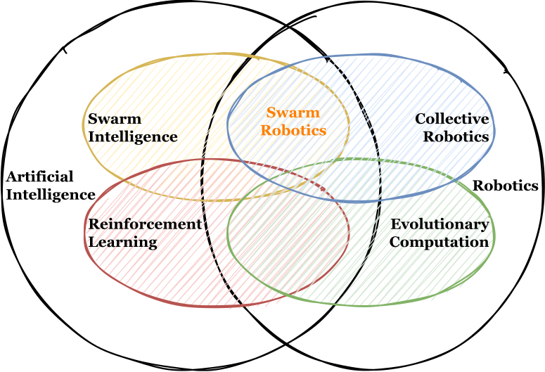

My current work is about **grasp-free manipulation**: moving objects by shaping and controlling the surface beneath them rather than closing a gripper around them. This is useful when objects are fragile, irregular, soft, food-like, or too varied for a single end-effector to handle reliably.

{fig-alt="Sketch of research interests" width="85%"}

## Current Directions

### Soft manipulation surfaces

Robotic manipulation surfaces deform underneath an object and move it by changing contact geometry. The central challenge is balancing three goals that often fight each other: precise control, hardware simplicity, and scalable workspace size.

My PhD work explores fabric-based surfaces actuated by sparse, coordinated vertical actuators. Instead of treating manipulation as a grasping problem, I model how surface deformation can create usable object motion for positioning, transfer, and handling heterogeneous objects.

### Modular grasp-free manipulation

A single soft surface is useful, but many applications need larger workspaces. Modular surfaces can expand the workspace, but transferring objects across module boundaries is difficult because neighboring modules mechanically interact through the surface.

My recent work studies shared-boundary actuation, hierarchical planning, directional object passing, and compensation for passive-object disturbance caused by mechanically coupled modules.

### Tactile sensing and self-supervised learning

During my UCL visit, I have been working on tactile sensing for in-hand object shape and quantity inference with a leapXela-style tactile robot setup. The project involves self-supervised representation learning with Masked Autoencoders (MAE) and Joint Embedding Predictive Architectures (JEPA), plus MuJoCo simulation of normal and shear tactile channels for data collection.

### Earlier work: swarm robotics and collectives

Before my PhD, I worked on collective robotics and decision-making in dynamic environments. This included multi-robot foraging, moving depots, collective decision models, and quantum-inspired approaches to identifying influential agents in swarms.

## Publications

1. **Pratik Ingle**, Jorn Lambertsen, Kasper Stoy, and Andres Faina. 2026. *Scalable Surface-Based Manipulation Through Modularity and Inter-Module Object Transfer*. [arXiv:2601.21884](https://arxiv.org/abs/2601.21884).

2. **Pratik Ingle**, Kasper Stoy, and Andres Faina. 2025. *Heterogeneous object manipulation on nonlinear soft surface through linear controller*. IEEE 21st International Conference on Automation Science and Engineering (CASE), 1780-1787. [DOI](https://doi.org/10.1109/CASE58245.2025.11163787).

3. **Pratik Ingle**, Kasper Stoy, and Andres Faina. 2025. *Soft Manipulation Surface With Reduced Actuator Density For Heterogeneous Object Manipulation*. IEEE 8th International Conference on Soft Robotics (RoboSoft), selected for oral presentation. [DOI](https://doi.org/10.1109/RoboSoft63089.2025.11020841).

## Talks {#talks}

- **RoboSoft 2026**: *Scalable Surface-Based Manipulation Through Modularity and Inter-Module Object Transfer*.
- **CASE 2025**: *Heterogeneous object manipulation on nonlinear soft surface through linear controller*.
- **RoboSoft 2025**: *Soft Manipulation Surface With Reduced Actuator Density For Heterogeneous Object Manipulation*.
- **EI 2025**: *Harnessing Fabric Softness and Scalability for Object Manipulation*.
- **ANTS 2024**: *Moving Depot (MOD): An Efficient Depot Motion Strategy for Multi-Robot Foraging*.

## Research Experience

**REAL Lab, IT University of Copenhagen**  
PhD researcher, Oct 2023-present. Learning and control for grasp-free manipulation robots.

**CRISP Lab, University College London**  
Visiting PhD researcher, Mar-Aug 2026. Tactile sensing, leapXela-style robots, MAE/JEPA representation learning, and MuJoCo sensor simulation.

**Swarm Lab, NJIT and IISER Bhopal**  
Research on decision-making in collectives, dynamic environments, animal behaviour, and bio-inspired swarm robotics.

**MOON Lab, IISER Bhopal**  
Robotics hardware, ROS, UAVs, embedded systems, and swarm robotics.

## Schools and Workshops

- Advanced Course on Data Science and Machine Learning, 2025.
- IEEE RAS Summer School on Multi-Robot Systems, 2024.
- SCIoI and ISAB Summer School on Embodied Intelligence: Perception and Learning, 2023.
- COSMOS Summer School on Modeling Social and Collective Behavior, 2022.
- PRAIRIE/MIAI Artificial Intelligence Summer School, 2021.
